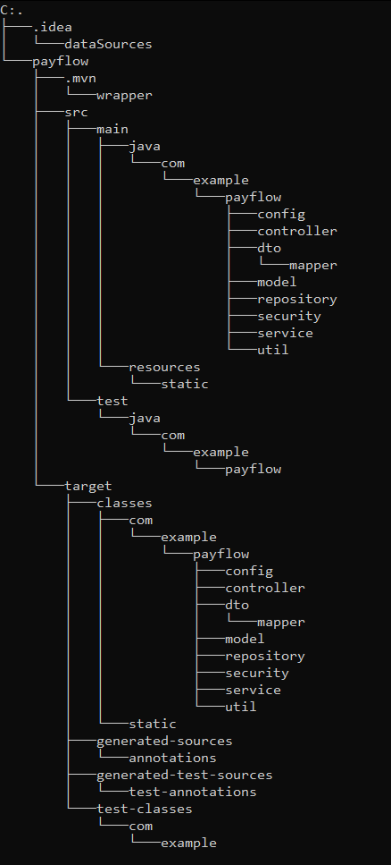
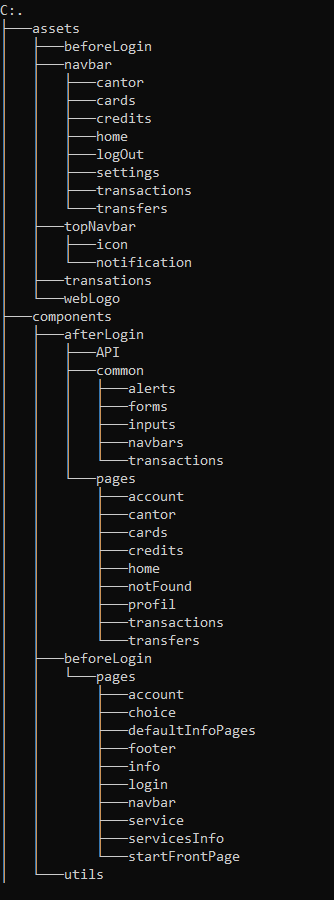
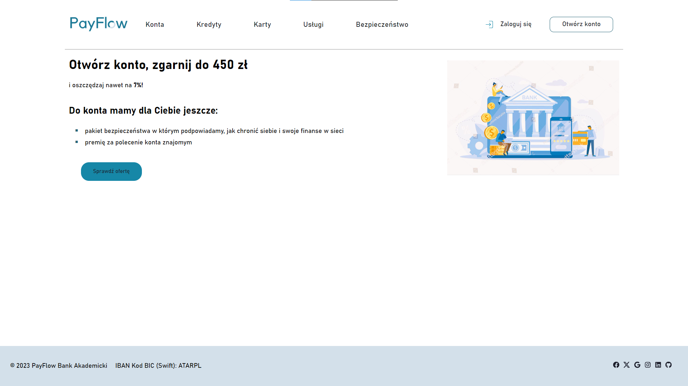
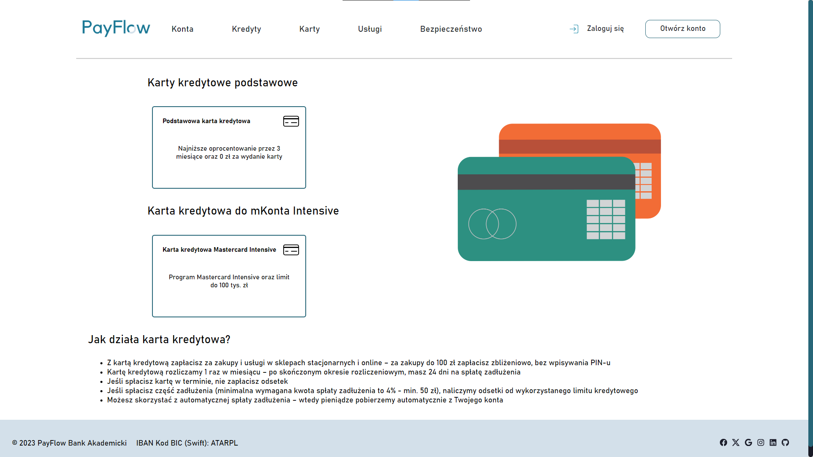
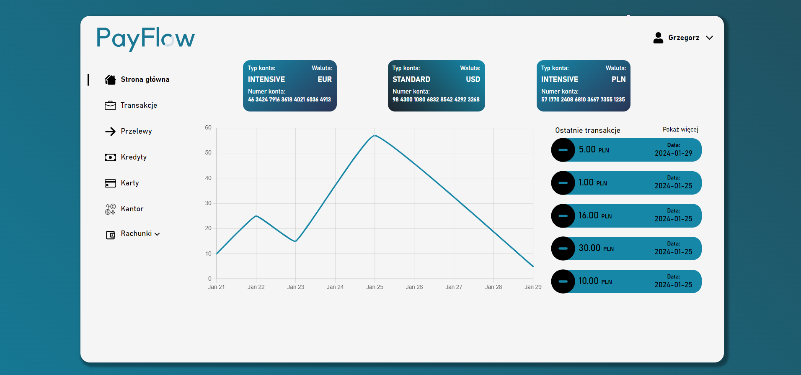
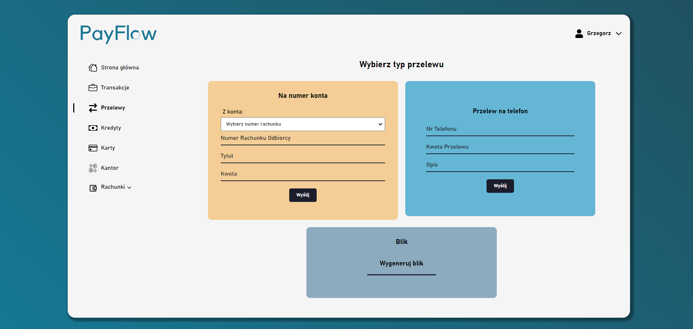
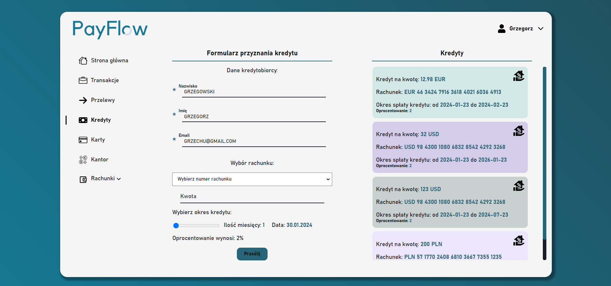
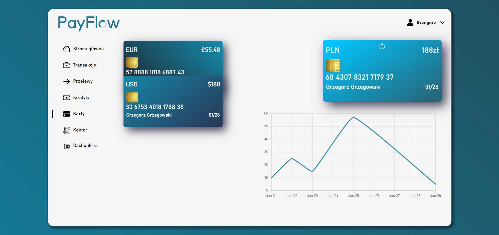
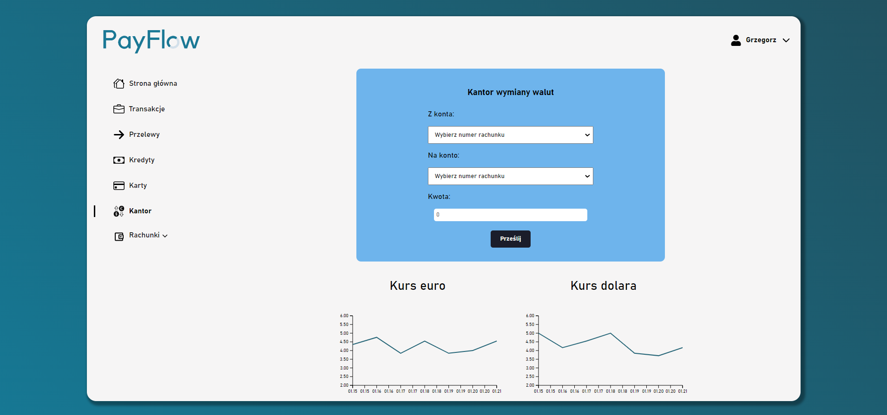
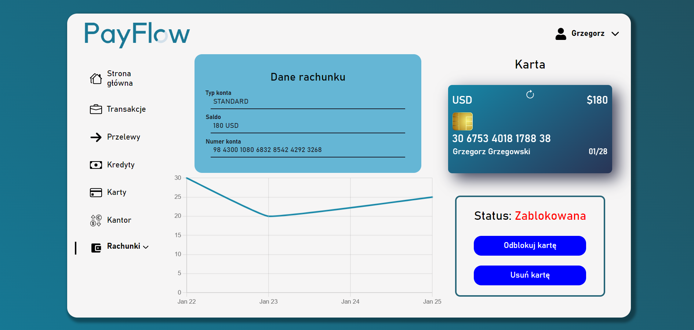

### The bank website

- backend written in Java Spring
- frontend written in ReactJS

## Authors

- [@enqer](https://github.com/enqer)
- [@fkielbasa](https://github.com/fkielbasa)
- [@Narothe](https://github.com/Narothe)

## About project

The frontend as well as the backend was written as part of a project in the course "Object-oriented and Component Technologies". The project involved first creating a good backend and then moving on to implementation on the frontend side.

## How to install

### Install Backend

#### Install [Java](https://www.oracle.com/java/technologies/downloads/).

#### In `\payflow\backend\payflow\src\main\resources` you need to create file named: `env.properties`. In this file you need to connect to database and e-mail service. The structure of this file looks like this:
```
DB_URL=
DB_DATABASE_NAME=
DB_PASSWORD=
SECRET_KEY=
MAIL_HOST=
MAIL_PORT=
MAIL_USERNAME=
MAIL_PASSWORD=
```

### Install Frontend

#### Get [Node.js](https://nodejs.org/en).

## How to start

### Backend

- Run *PayflowApplication* class. File is in `./backend/payflow/src/main/java/com.example.payflow`.

- Open bat file in backend directory.

### Frontend

- Write `npm install` then `npm start`. 

If problem with charts will occurred please try this:

- Remove `node_modules` and `package-lock.json` and then run `npm install`

- Or try clearing out npm cache `npm cache clean --force`

- Or run command with --legacy-peer-deps option `npm install --legacy-peer-deps`

- Or run command with --force option `npm install --force`

orginal solution: [stackoverflow](https://stackoverflow.com/questions/71582397/eresolve-unable-to-resolve-dependency-tree-while-installing-a-pacakge)

- Open bat file in frontend directory.

## Project started. What now?

Open [http://localhost:3000]( http://localhost:3000) in your browser to view the website.

### The Browsers used while creating project:

- Google Chrome version: 120.0.6099.217 (64-bit)

## Project Structure

The components are divided into catalogs that correspond to applications. If a component (element) is used only in one place in the project, it is located in the parent folder.

### Backend



### Frontend



Screenshot 1:


Screenshot 2:


Screenshot 3:


Screenshot 4:


Screenshot 5:


Screenshot 6:


Screenshot 7:


Screenshot 8:

